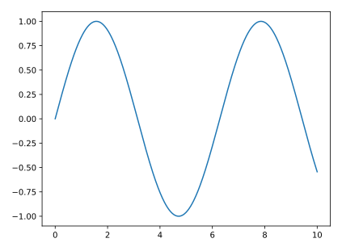
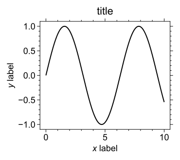

# ckplotlib
Add-on library of Matplotlib for publication quality plots

# Usage [under construction]

Context manager of `ckplotlib.ckplot.ckfigure` enables you to markup and save high-quality figures easily.

## common codes
```[python]
import numpy as np
import matplotlib.pyplot as plt
import ckplotlib.ckplot as cplt

x = np.linspace( 0, 10, 500 )
y = np.sin( x )
```

## matplotlib normal
```[python]
plt.figure()
plt.plot( x, y )
```


## ckplotlib normal
```[python]
with cplt.ckfigure():
    plt.figure()
    plt.plot( x, y )
```


## markup and save figure
```[python]
figure_props = cplt.get_figure_props(
    save_dirname = 'result',
    save_fname   = 'fig_cplt1',
    plt_props = dict(
        xlabel = '$x$ label',
        ylabel = '$y$ label',
        title  = 'title'
    )
)

with cplt.ckfigure( **figure_props ):
    plt.figure()
    plt.plot( x, y )
```


