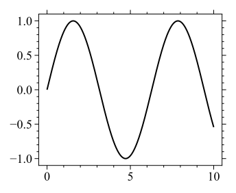

# ckplotlib
Add-on library of Matplotlib for publication quality plots


## Installation / uninstallation

You can install `ckplotlib` by `pip` command.

```
$ pip install git+https://github.com/mchizaki/ckplotlib.git
```

Uninstallation:

```
$ pip uninstall ckplotlib
```


## Quick start guide

Context manager of `ckplotlib.ckplot.ckfigure` enables you to markup and save high-quality figures easily.

### Plotting data

```python
import numpy as np
x = np.linspace(0, 10, 500)
y1 = np.sin(x)
y2 = np.cos(x)
y3 = 1 - 0.2 * x/5
```


### matplotlib and ckplotlib figures

```python
import matplotlib.pyplot as plt
import ckplotlib.ckplot as cplt
```

| matplotlib                         | ckplotlib                           |
| ---------------------------------- | ----------------------------------- |
|  |  |


### matplotlib code

```python
plt.figure()
plt.plot(x, y1, label=r'$\sin(x)$')
plt.plot(x, y2, label=f'$\cos(x)$')
plt.plot(x, y3, label='$1 - 0.2x$')
plt.xlabel('$x$ label')
plt.ylabel('$y$ label')
plt.title('title')
plt.legend(title='func', **cplt.LGD_PARAMS)
```


### ckfigure code

There are two ways to create the figure in `ckplotlib`. All methods require few changes from the `matplotlib` code.


#### method 1: context manager  [simplest way]

You just add `with cplt.ckfigure():` to your matplotlib code as follows:

```python
with cplt.ckfigure():
    plt.figure()
    plt.plot(x, y1, label=r'$\sin(x)$')
    plt.plot(x, y2, label=f'$\cos(x)$')
    plt.plot(x, y3, label='$1 - 0.2x$')
    plt.xlabel('$x$ label')
    plt.ylabel('$y$ label')
    plt.title('title')
    plt.legend(title='func', **cplt.LGD_PARAMS)
```

How to save this figure => next section


#### method 2: decorator

```python
@cplt.ckfigure()
def plot_func():
    plt.figure()
    plt.plot(x, y1, label=r'$\sin(x)$')
    plt.plot(x, y2, label=f'$\cos(x)$')
    plt.plot(x, y3, label='$1 - 0.2x$')
    plt.xlabel('$x$ label')
    plt.ylabel('$y$ label')
    plt.title('title')
    plt.legend(title='func', **cplt.LGD_PARAMS)

plot_func()
```

How to save this figure => next section


### ckfigure props

`ckfigure` can receive some options of `figure_props` of `dict` type. The function of `ckplotlib.ckplot.get_figure_props` helps you create `figure_props` dictionary.

#### saving figure

```python
figure_props = cplt.get_figure_props(
    save_dirname = 'result',
    save_fname   = 'fig_cplt_test1'
)

with cplt.ckfigure(**figure_props):
    plt.figure()
    plt.plot(x, y1)
    plt.xlabel('$x$ label')
    plt.ylabel('$y$ label')
    plt.title('title')
```

This code makes a figure and saves it as `<save_dirname>/<save_fname>.png`, `<save_dirname>/<save_fname>.svg`, and `<save_dirname>/<save_fname>.csv`.

> [!NOTE]
>
> `figure_props` generated by `ckplotlib.ckplot.get_figure_props` is the following dictionary.
>
> ```
> >>> import ckplotlib.ckplot as cplt
> >>> figure_props = cplt.get_figure_props(
> ...     save_dirname = 'result',
> ...     save_fname   = 'fig_cplt_test1'
> ... )
> >>> print(figure_props)
> {
> 	'save_props': {
> 		'dirname': 'result',
> 		'fname': 'fig_cplt_test1'
> 	},
> 	'savecsv_props': {
> 	}
> }
> ```


#### markup figure

Figure markup with `pyplot`, such as `plt.xlabel`, `plt.ylabel`, etc., can be realized with `figure_props` in `ckplotlib`.

```python
props = cplt.get_figure_props(
    save_dirname = 'result',
    save_fname   = 'fig_cplt_test1_',
    plt_props = dict(
        xlabel = '$x$ label',
        ylabel = '$y$ label',
        title  = 'title'
    ),
    plt_prop_kwargs = dict(
        legend = dict(
            title = 'func'
        )
    )
)

with cplt.ckfigure(**props):
    plt.figure()
    plt.plot(x, y1, label=r'$\sin(x)$')
    plt.plot(x, y2, label=f'$\cos(x)$')
    plt.plot(x, y3, label='$1 - 0.2x$')
```


## ckfigure options

Context manager of `ckplotlib.ckplot.ckfigure` can receive the `figure_props` of `dict`.
The function of `ckplotlib.ckplot.get_figure_props` helps you create `figure_props` dictionary.


All options of `ckplotlib.ckplot.get_figure_props` are as follows:


1. markup options of `matplotlib.pyplot`

   - **plt_props: *dict*, default: `{}`**

   - **plt_prop_kwargs : *dict*, default: `{}`**

   e.g.

   ```python
   plt_props = dict(
       xlabel = 'Temperature (K)',
       yscale = 'log'
   )
   
   plt_prop_kwargs = dict(
       legend = dict(
           bbox_to_anchor = (1, 1)
       )
   )
   ```

2. save figure

   - **fig : *bool*, default: `True`** <br>if `True`: save the figure image

   - **save_dirname : *str | None*, default:  `None`** <br>directory name of the saved figure file

   - **save_fname : *str*, default: `None`**<br>file name of saved figure file. If `None`: skip saving the figure image.

   - **save_props : *dict*, default:**<br>

     ```python
     dict(
         dirname: str | None = None,
         fname:   str | None = None,
         png_dpi: int        = 300,
         svg_dpi: int        = 150,
         SAVE_PARAMS: dict = dict(
             bbox_inches: str   = 'tight',
             pad_inches:  float = 0.2
         ),
         save_png: bool = True,
         save_svg: bool = True,
         save_pkl: bool = False
     )
     ```

3. export plotted data as csv file

   - **csv : *bool*, default: `True`**<br>
     if `True`: save csv file

   - **savecsv_subdirname : *str | None*, default: `None`**<br>if `None` or `"."`: csv file is saved in the same directory as the image files of the figure (`<save_dirname>`); otherwise, `<save_dirname>/<savecsv_subdirname>`.

   - **savecsv_props : *dict*, default:**<br>

     ```python
     dict(
         dirname:    str | None = None,
         subdirname: str | None = None,
         fname:      str | None = None,
         header:     str | None = None,
         common_x:         bool = True,
         subplot_common_x: bool = False
     )
     ```

4. Range options

   - **xmin, xmax, ymin, ymax : *float | None*, default: `None`**
       - minimum/maximum value that determines the display range of graph. These arguments are an alternative to `matplotlib.pyplot.xlim` and `ylim`.
       - if `None`: automatically determinted

   - **common_xlim, common_ylim : *bool*, default: `True`** <br>Use common axis range when the figure includes multiple ax subplots

   - **is_ylim_adjust_xlim : *bool*, default: `True`**

   - **axes_xmargins, axes_ymargins : *list[float]*, default: `[0.05, 0.05]`**<br>Padding from minimum and maximum values in the graph,
       specified as a percentage of the size of Axis [from 0 to 1]

   - **adjust_lim: *bool*, default: `True`**<br>Set `False` if you do no want `ckplotlib` to adjust the drawing range.

5. Range options for logscale<br>The respective options for `x` and `y` axes are valid if `plt.xscale` and `plt.yscale` are `"logscale"`.

   - **is_xlog_intlim : *bool*, default: `False`** | **is_ylog_intlim : *float*, default: `True`**<br>If `True`: axis range of $[10^a, 10^b]$ is determined so that $a$ and $b$ are integers.

   - **is_xlog_format | is_ylog_format : *bool*, default: `True`**<br>If `True`: Exponential notation like $10^a$​ is used.

   - **xlog_ticker_exponent_range_thr | ylog_ticker_exponent_range_thr, *int*, default: `10`**<br>If $b / a$ exceeds this threshold value where the axis range is $[10^a, 10^b]$, minor ticks are set at $10^m$ ($m$ is an integer).

       | Normal logscale `ticker`               | Wide-range logscale `ticker`           |
       | -------------------------------------- | -------------------------------------- |
       |  |  |

       

   - Range max options:
       - **set_xlog_range_max | set_ylog_range_max : *bool*, default: `False`**<br>If `True`: Limit the drawing range according to the `set_x(y)log_range_max_props` option.

       - **set_xlog_range_max_props | set_ylog_range_max_props : *dict*, default:** 

           ```python
           dict(
               exponent_range_max = 8,
               max_is_fixed       = True,
               min_is_fixed       = False
           )
           ```

           Limit the drawing range so that it does not exceed `10**exponent_range_max`. Set `max_is_fixed` (`min_is_fixed`) to `True` to fix the maximum (minimum) side of the drawing range. Do not set both `max_is_fixed` and `min_is_fixed` to the same setting.

6. annotate

   - **annotate_str : *str | None*, default: `None`**

   - **annotate_props : *dict*, default:**

     ```python
     dict(
         x        = None,
         y        = None,
         loc      = 'bottom',
         ha       = 'left',
         va       = 'top',
         border   = True,
         fontsize = 'x-small'
     )
     ```

7. Others

   - **no_line : *bool*, default: `False`**<br>Set to `True` if you intend that `matplotlib.pyplot.Line2D` is not included in the figure. Normally, this decision is made automatically, so this option is not likely to be used.


## Example figures (linear)

common codes:
```python
import numpy as np
import matplotlib.pyplot as plt
import ckplotlib.ckplot as cplt

x = np.linspace(0, 10, 500)
y = np.sin(x)
```

### matplotlib normal
```python
plt.figure()
plt.plot(x, y)
```


### ckplotlib normal
```python
with cplt.ckfigure():
    plt.figure()
    plt.plot(x, y)
```


### markup and save figure
```python
figure_props = cplt.get_figure_props(
    save_dirname = 'result',
    save_fname   = 'fig_cplt1',
    plt_props = dict(
        xlabel = '$x$ label',
        ylabel = '$y$ label',
        title  = 'title'
    )
)

with cplt.ckfigure(**figure_props):
    plt.figure()
    plt.plot(x, y)
```


