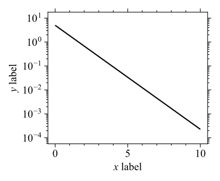
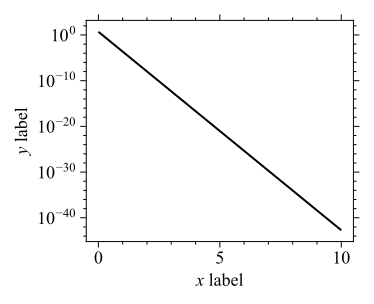
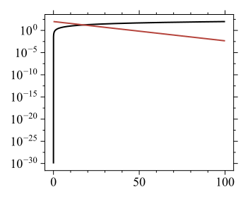
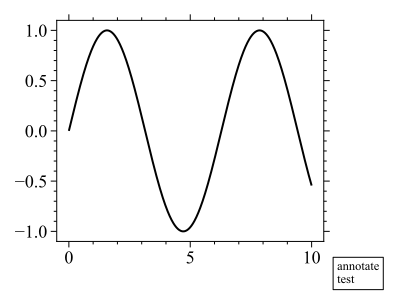
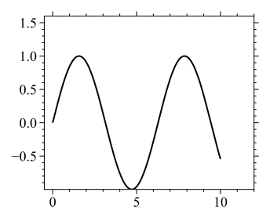
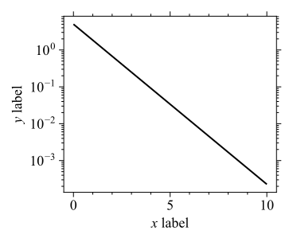
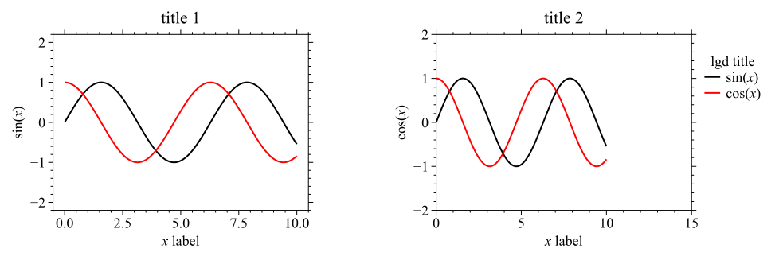

# ckplotlib
Add-on library of Matplotlib for publication quality plots


## Installation / uninstallation

You can install `ckplotlib` by `pip` command.

```
$ pip install git+https://github.com/mchizaki/ckplotlib.git
```

Uninstallation:

```
$ pip uninstall ckplotlib
```


## Quick start guide

Context manager of `ckplotlib.ckplot.ckfigure` enables you to markup and save high-quality figures easily.

### Plotting data

```python
import numpy as np
x = np.linspace(0, 10, 500)
y1 = np.sin(x)
y2 = np.cos(x)
y3 = 1 - 0.2 * x/5
```


### matplotlib and ckplotlib figures

```python
import matplotlib.pyplot as plt
import ckplotlib.ckplot as cplt
```

| matplotlib                         | ckplotlib                           |
| ---------------------------------- | ----------------------------------- |
|  |  |


### matplotlib code

```python
plt.figure()
plt.plot(x, y1, label=r'$\sin(x)$')
plt.plot(x, y2, label=f'$\cos(x)$')
plt.plot(x, y3, label='$1 - 0.2x$')
plt.xlabel('$x$ label')
plt.ylabel('$y$ label')
plt.title('title')
plt.legend(title='func', **cplt.LGD_PARAMS)
```


### ckfigure code

There are two ways to create the figure in `ckplotlib`. All methods require few changes from the `matplotlib` code.


#### method 1: context manager  [simplest way]

You just add `with cplt.ckfigure():` to your matplotlib code as follows:

```python
with cplt.ckfigure():
    plt.figure()
    plt.plot(x, y1, label=r'$\sin(x)$')
    plt.plot(x, y2, label=f'$\cos(x)$')
    plt.plot(x, y3, label='$1 - 0.2x$')
    plt.xlabel('$x$ label')
    plt.ylabel('$y$ label')
    plt.title('title')
    plt.legend(title='func', **cplt.LGD_PARAMS)
```

How to save this figure => next section


#### method 2: decorator

```python
@cplt.ckfigure()
def plot_func():
    plt.figure()
    plt.plot(x, y1, label=r'$\sin(x)$')
    plt.plot(x, y2, label=f'$\cos(x)$')
    plt.plot(x, y3, label='$1 - 0.2x$')
    plt.xlabel('$x$ label')
    plt.ylabel('$y$ label')
    plt.title('title')
    plt.legend(title='func', **cplt.LGD_PARAMS)

plot_func()
```

How to save this figure => next section


### ckfigure props

`ckfigure` can receive some options of `figure_props` of `dict` type. The function of `ckplotlib.ckplot.get_figure_props` helps you create `figure_props` dictionary.

#### saving figure

```python
figure_props = cplt.get_figure_props(
    save_dirname = 'result',
    save_fname   = 'fig_cplt_test1'
)

with cplt.ckfigure(**figure_props):
    plt.figure()
    plt.plot(x, y1)
    plt.xlabel('$x$ label')
    plt.ylabel('$y$ label')
    plt.title('title')
```

This code makes a figure and saves it as `<save_dirname>/<save_fname>.png`, `<save_dirname>/<save_fname>.svg`, and `<save_dirname>/<save_fname>.csv`.

> [!NOTE]
>
> `figure_props` generated by `ckplotlib.ckplot.get_figure_props` is the following dictionary.
>
> ```
> >>> import ckplotlib.ckplot as cplt
> >>> figure_props = cplt.get_figure_props(
> ...     save_dirname = 'result',
> ...     save_fname   = 'fig_cplt_test1'
> ... )
> >>> print(figure_props)
> {
> 	'save_props': {
> 		'dirname': 'result',
> 		'fname': 'fig_cplt_test1'
> 	},
> 	'savecsv_props': {
> 	}
> }
> ```


#### markup figure

Figure markup with `pyplot`, such as `plt.xlabel`, `plt.ylabel`, etc., can be realized with `figure_props` in `ckplotlib`.

```python
props = cplt.get_figure_props(
    save_dirname = 'result',
    save_fname   = 'fig_cplt_test1_',
    plt_props = dict(
        xlabel = '$x$ label',
        ylabel = '$y$ label',
        title  = 'title'
    ),
    plt_prop_kwargs = dict(
        legend = dict(
            title = 'func'
        )
    )
)

with cplt.ckfigure(**props):
    plt.figure()
    plt.plot(x, y1, label=r'$\sin(x)$')
    plt.plot(x, y2, label=f'$\cos(x)$')
    plt.plot(x, y3, label='$1 - 0.2x$')
```


## ckplotlib.ckplot.ckfigure

Context manager of `ckplotlib.ckplot.ckfigure` has many options to markup and save your figures.

### Call signatures

1. using `figure_props`

   ```python
   with cplt.ckfigure(**figure_props, **kwargs):
   ```

2. using `figure_props_list`<br>`figure_props_list` is a list of multiple `figure_props`, namely,

   ```python
   figure_props_list = [fig_props1, fig_props2, ...]
   ```

   You can call ckfigure by using the figure props list as follows:

   ```python
   with cplt.ckfigure(*figure_props_list, **kwargs):
   ```


### Options

#### kwargs

1. Options whose default values are set in `ini` file

   - **cycle : *cycler.Cycler | dict | None*, default: `ckplotlib.cycle.ck_cycle`**

   - **use_mplstyle_base : *bool*, default: `True`**<br>If `True`: search and read `base.mplstyle`

   - **mplstyle_font : *{'arial', 'times', 'any font name', 'none'} | None*, default: `"arial"`**<br>

     If `None` or `"none"`: skip reading font-mplstyle file. otherwise: search and read font-mplstyle file of `mplstyle_font` (* file name with or without fmt of `.mplstyle`)

   - **show : *bool*, default: `False`**<br>This is an option for an alternative function to `matplotlib.pyplot.show()`. If `True`: show figure by `matplotlib.pyplot.show()`. If `*figure_props_list` is used, only the last figure in the list is displayed.

   - **inline_show : *bool*, default: `True`**<br>If `True`: show figure when you use Matplotlib Inline Back-end.

   - **close : *bool*, default: `True`**<br>If `True`: close figure after saving figures.

   - **common_subplot_props : *bool*, default: `True`**<br>This option is valid when `fig_props_list` of ckfigure's option and `plt.subplot` are used. If this option is `False`, the individual `figure_props` can be applied to each subplot. Each `figure_props` is set as an element of a list of `figure_props_list`. The length of the list of `figure_props_list` and the number of subplots (namely, the length of the list of `plt.gcf().axes`) must be equal (See: <a id='#figure-example-subplot1'>Sample figures (subplot)</a>).

> [!Important]
>
> Do not use `matplotlib.pyplot.show()` as follows:
>
> ```python
> with cplt.ckfigure(**props):
>     plt.figure()
>     plt.plot(x, y1, label=r'$\sin(x)$')
>     plt.plot(x, y2, label=f'$\cos(x)$')
>     ...
>     plt.show()
> ```
>
> This script causes the following error message:
>
> ```
> [error] CkFigure.set_figure_style
> plot axes do not exist.
> ```
>
> This is because `ckplotlib` tries to makeup and save the figure after `plt.show()`. Please use the option of `show` instead of `matplotlib.pyplot.show()` when you use `ckfigure`.


2. Other options

   - **mplstyle : *str | None*, default: `None`**<br>Specify the file name of mplstyle you want to load additionally, if any (* file name with or without fmt of `.mplstyle`)
   - **mplstyle_dir : *str | None*, default: `None`**
     Specify a directory name if there is additional directory to search mplstyle files.


#### figure_props

Dictionary with figure settings.  The function of `ckplotlib.ckplot.get_figure_props` helps you create `figure_props` dictionary. (Next Section)


## ckplotlib.ckplot.get_figure_props

`ckplotlib.ckplot.get_figure_props` is a function to help you create `figure_props` dictionary for `ckplotlib.ckplot.ckfigure`. All options are as follows:

### (1) Markup options of `matplotlib.pyplot`

- **plt_props: *dict*, default: `{}`**

- **plt_prop_kwargs : *dict*, default: `{}`**

e.g.

```python
plt_props = dict(
    xlabel = 'Temperature (K)',
    yscale = 'log'
)

plt_prop_kwargs = dict(
    legend = dict(
        bbox_to_anchor = (1, 1)
    )
)
```


### (2) Save figure options

- **fig : *bool*, default: `True`** <br>if `True`: save the figure image

- **save_dirname : *str | None*, default:  `None`** <br>directory name of the saved figure file

- **save_fname : *str*, default: `None`**<br>file name of saved figure file. If `None`: skip saving the figure image.

- **save_props : *dict*, default:**<br>

  ```python
  dict(
      dirname: str | None = None,
      fname:   str | None = None,
      png:    bool = True, # set by config.ini
      svg:    bool = True, # set by config.ini
      png_dpi: int = 300, # set by config.ini
      svg_dpi: int = 150, # set by config.ini
      save_params: dict = dict(
          bbox_inches: str   = 'tight',
          pad_inches:  float = 0.2
      ) # ckplotlib.savefig.SAVE_PARAMS
      **kwargs
  )
  ```

  - (*all keys are optional)

  - **dirname : *str | None*, default: `None`**<br>This is updated by `<save_dirname>` if `save_dirname` is not `None`.

  - **fname: *str | None*, default: `None`**<br>This is updated by `<save_fname>` if `save_fname` is not `None`.

  - **png : *bool*, default: `True` (set by `config.ini`)**<br>If `True`: save figure as png image

  - **svg : *bool*, default: `True` (set by `config.ini`)**<br>If `True`: save figure as svg image

  - **png_dpi : *int*, default: `300` (set by `config.ini`)**<br>Resolution in dos per inch for png images

  - **svg_dpi : *int*, default: `150` (set by `config.ini`)**<br>Resolution in dos per inch for svg images

  - **save_params : *dict*, default:**

    ```python
    dict(
        bbox_inches:   str = 'tight',
        pad_inches:  float = 0.2
    )
    ```


### (3) Export plotted data as csv file

- **csv : *bool*, default: `True`(set by `config.ini`)**<br>
  if `True`: save csv file

- **savecsv_subdirname : *str | None*, default: `None`**<br>if `None` or `"."`: csv file is saved in the same directory as the image files of the figure (`<save_dirname>`); otherwise, `<save_dirname>/<savecsv_subdirname>`.

- **savecsv_props : *dict*, default:**<br>

  ```python
  dict(
      dirname:    str | None = None,
      subdirname: str | None = None,
      fname:      str | None = None,
      header:     str | None = None,
      common_x:         bool = True,
      subplot_common_x: bool = False
  )
  ```

  - (*all keys are optional)

  - **dirname : *str | None*, default: `None`**<br>Save directory name. If `None`: same directory as the figure image `<save_dirname>`.

  - **subdirname : *str | None*, default: `None`**<br>This is updated by `<savecsv_subdirname>` if `savecsv_subdirname` is not `None`.

  - **fname : *str*, default: `None`**<br>Save file name. If `None`: same file name as the figure image `<save_fname>`.

  - **header : *str | None*, default: `None`**<br>csv file example with `header = 'this is header'`

    ```csv
    this is header
    theta,          sin(theta),          cos(theta)
      0.0,                 0.0,                 1.0
      1.0,  0.8414709848078965,  0.5403023058681398
      2.0,  0.9092974268256817, -0.4161468365471424
    ...
    ```

  - **common_x : *bool*, default: `True`**<br>If `True`: x data is output to the same column of the csv file.<br>
    Example:

    ```python
    x1 = np.array([0, 1, 2, 3])
    x2 = np.array([0, 2, 4, 6])
    with cplt.ckfigure(**figure_props):
        plt.figure()
        plt.plot(x1, x1**2)
        plt.plot(x2, x2**2)
    ```

    - csv file with `common_x = True`:

      ```
      x,    y1,    y2
      0,   0.0,   0.0
      1,   1.0,
      2,   4.0,   4.0
      3,   9.0,
      4,      ,  16.0
      6,      ,  36.0
      ```

    - csv file with `common_x = False`:

      ```
      x1,    y1,    x2,    y2
       0,     0,     0,     0
       1,     1,     2,     4
       2,     4,     4,    16
       3,     9,     6,    36
      ```

  - **subplot_common_x : *bool*, default: `False`**<br>If `True`: x data is output to the same column of the csv file when the figure object has multiple axes generated by `matplotlib.pyplot.subplot`, etc.<br>Example:

    ```python
    x1 = np.array([0, 1, 2, 3])
    x2 = np.array([0, 2, 4, 6])
    with cplt.ckfigure(**figure_props):
        plt.figure()
        plt.subplot(211)
        plt.plot(x1, x1**2)
        plt.subplot(212)
        plt.plot(x2, x2**2)
    ```

    - csv file with `subplot_common_x = True`:

      ```
        x, f1[y], f2[y]
      0.0,   0.0,   0.0
      1.0,   1.0,
      2.0,   4.0,   4.0
      3.0,   9.0,
         ,      ,  16.0
         ,      ,  36.0
      ```

    - csv file with `subplot_common_x = False`:

      ```
      f1[x], f1[y], f2[x], f2[y]
          0,     0,     0,     0
          1,     1,     2,     4
          2,     4,     4,    16
          3,     9,     6,    36
      ```


### (4) Range options

- **xmin, xmax, ymin, ymax : *float | None*, default: `None`**
    - minimum/maximum value that determines the display range of graph. These arguments are an alternative to `matplotlib.pyplot.xlim` and `ylim`.
    - if `None`: automatically determinted

- **common_xlim, common_ylim : *bool*, default: `True`** <br>Use common axis range when the figure includes multiple ax subplots

- **adjust_ylim_in_xlim : *bool*, default: `True`**<br>y-axis range is determined by the maximum and minimum values of plotted data. If `True`,  the maximum/minimum value is determined by the data within the specified x-range. Otherwise, the maximum/minimum value is determined by all data including outside the specified x-axis range.

- **axes_xmargins, axes_ymargins : *list[float]*, default: `[0.05, 0.05]`**<br>Padding from minimum and maximum values in the graph,
    specified as a percentage of the size of Axis [from 0 to 1]

- **adjust_lim: *bool*, default: `True`**<br>Set `False` if you do no want `ckplotlib` to adjust the drawing range.


### (5) Range options for logscale

The respective options for `x` and `y` axes are valid if `plt.xscale` and `plt.yscale` are `"logscale"`.

- **is_xlog_intlim : *bool*, default: `False`** | **is_ylog_intlim : *bool*, default: `True`**<br>If `True`: axis range of $[10^a, 10^b]$ is determined so that $a$ and $b$ are integers.

- **is_xlog_format | is_ylog_format : *bool*, default: `True`**<br>If `True`: Exponential notation like $10^a$​ is used.

- **xlog_ticker_exponent_range_thr | ylog_ticker_exponent_range_thr, *int*, default: `10`**<br>If $b / a$ exceeds this threshold value where the axis range is $[10^a, 10^b]$, minor ticks are set at $10^m$ ($m$ is an integer).

    | Normal logscale `ticker`               | Wide-range logscale `ticker`           |
    | -------------------------------------- | -------------------------------------- |
    |  |  |

- Range max options:
    - **set_xlog_range_max | set_ylog_range_max : *bool*, default: `False`**<br>If `True`: Limit the drawing range according to the `set_x(y)log_range_max_props` option.

    - **set_xlog_range_max_props | set_ylog_range_max_props : *dict*, default:**

        ```python
        dict(
            exponent_range_max = 8,
            max_is_fixed       = True,
            min_is_fixed       = False
        )
        ```

        Limit the drawing range so that it does not exceed `10**exponent_range_max`. Set `max_is_fixed` (`min_is_fixed`) to `True` to fix the maximum (minimum) side of the drawing range. Do not set both `max_is_fixed` and `min_is_fixed` to the same setting.

        | set_ylog_range_max: `False`                                  | set_ylog_range_max: `True`                                |
        | ------------------------------------------------------------ | --------------------------------------------------------- |
        |  |  |

    - **save_original_fig : *bool*, default: `True`**<br>If `True`: save the original figure image in `<save_dirname>/original/` when the figure is modified by the above options.


### (6) hlines and vlines options

- **hlines_yvals : *list[float]*, default: `[ ]`**
  list of y values for which you want to draw horizontal lines by `plt.hlines`

- **vlines_xvals : *list[float]*, default: `[ ]`**
  list of x values for which you want to draw vertical lines by `plt.vlines`

- **hlines_props | vlines_props: *dict*, default:**

  ```python
  dict(
      color     = ckcolor[ 'lightgray' ],
      linewidth = 1,
      linestyle = '--',
      zorder    = -100
  )
  ```

  options of `plt.hlines` or `plt.vlines`


### (7) Annotation options

- **annotate_str : *str | None*, default: `None`**

- **annotate_props : *dict*, default:**

  ```python
  dict(
      fontsize: str | int = 'x-small',
      border:        bool = True,
      loc:     str | None = 'bottom',
      x:     float | None = None,
      y:     float | None = None,
      ha:      str | None = None,
      va:      str | None = None
  )
  ```

  - (*all keys are optional)
  - **fontsize : *str | int*, default: `'x_small'`**
  - **border : *bool*, default: `True`**<br>If `True`: box with border line
  - **loc : {`'bottom'` | `'inner lower left'` | `'inner lower right'` | `'inner upper left'` | `'inner upper right'` | `None`}**

  `x`, `y`, `ha`, and `va` are automatically set to reflect the `loc` settings. These properties can also be set manually using following keys.

  - **x | y: *float | None*, default: `None`**
  - **ha: *{`'center'` | `'right'` | `'left'` | `None` }*, default: `None`**
  - **va: *{`'center'` | `'top'` | `'bottom'` | `baseline` | `None` }*, default: `None`**

  | loc: `bottom` (default)                         | loc: `inner lower left`                          |
  | ----------------------------------------------- | ------------------------------------------------ |
  |  |  |


### (8) Other options

- **no_line : *bool*, default: `False`**<br>Set to `True` if you intend that `matplotlib.pyplot.Line2D` is not included in the figure. Normally, this decision is made automatically, so this option is not likely to be used.


## Other procedures

### ckplotlib.ckplot.addlinename

**ckplotlib.ckplot.addlinename(*\*args, line=`None`, ax=`None`*)**

Specify the column names when outputting line data to a csv file.


**Call signatures:**

```python
addlinename([xcol_name], ycol_name)
addlinename([xcol_name], ycol_name, line=line, ax=ax)
```

\* [ ] means optional


**Parameters:**


- **\*args** : the length of `args` is one or two
- **line : *matplotlib.pyplot.Line2D | None*, default: `None`**<br>`Line2D` object corresponding to the data for which the column names are specified. If `None`, `line` is automatically determined to be `ax.get_lines()[-1]`.
- **ax : *matplotlib.pyplot.Axes | None*, default: `None`**<br>`Axes` object. This option is used when `line` is `None`, namely, `line` is searched from `ax`. If `ax` is `None`,  `ax` is automatically determined to be `plt.gca()`.


**Examples**

```python
import numpy as np
import matplotlib.pyplot as plt
import ckplotlib.ckplot as cplt
SAVE_DIRNAME = 'result'
theta = np.arange(0, 10)
sin_theta = np.sin(theta)
cos_theta = np.cos(theta)
```


1. Example (without using `addlinename`)

   ```python
   figure_props = cplt.get_figure_props(
       save_dirname = SAVE_DIRNAME,
       save_fname   = 'fig_cplt_csv0'
   )
   with cplt.ckfigure(**figure_props):
       plt.figure()
       plt.plot(theta, sin_theta)
       plt.plot(theta, cos_theta)
   ```

   csv file:

   ```
     x,                  y1,                  y2
   0.0,                 0.0,                 1.0
   1.0,  0.8414709848078965,  0.5403023058681398
   2.0,  0.9092974268256817, -0.4161468365471424
   ...
   ```


2. Example (with using `addlinename` [only yname])

   ```python
   figure_props = cplt.get_figure_props(
       save_dirname = SAVE_DIRNAME,
       save_fname   = 'fig_cplt_csv1'
   )
   with cplt.ckfigure(**figure_props):
       plt.figure()
       plt.plot(theta, sin_theta)
       cplt.addlinename('sin(theta)')
       plt.plot(theta, cos_theta)
       cplt.addlinename('cos(theta)')
   ```

   csv file:

   ```
     x,          sin(theta),          cos(theta)
   0.0,                 0.0,                 1.0
   1.0,  0.8414709848078965,  0.5403023058681398
   2.0,  0.9092974268256817, -0.4161468365471424
   ...
   ```


3. Example (with using `addlinename` [xname and yname])

   ```python
   figure_props = cplt.get_figure_props(
       save_dirname = SAVE_DIRNAME,
       save_fname   = 'fig_cplt_csv2'
   )
   with cplt.ckfigure(**figure_props):
       plt.figure()
       plt.plot(theta, sin_theta)
       cplt.addlinename('theta', 'sin(theta)')
       plt.plot(theta, cos_theta)
       cplt.addlinename('theta', 'cos(theta)')
   ```

   csv file:

   ```
   theta,          sin(theta),          cos(theta)
     0.0,                 0.0,                 1.0
     1.0,  0.8414709848078965,  0.5403023058681398
     2.0,  0.9092974268256817, -0.4161468365471424
     ...
   ```


4. Example (with `common_x = False`)

   ```python
   figure_props = cplt.get_figure_props(
       save_dirname = SAVE_DIRNAME,
       save_fname   = 'fig_cplt_csv3',
       savecsv_props = dict(
           common_x = False
       )
   )
   with cplt.ckfigure(**figure_props):
       plt.figure()
       plt.plot(theta, sin_theta)
       cplt.addlinename('theta1', 'sin(theta)')
       plt.plot(theta, cos_theta)
       cplt.addlinename('theta2', 'cos(theta)')
   ```

   csv file:

   ```
   theta1,          sin(theta),  theta2,          cos(theta)
      0.0,                 0.0,     0.0,                 1.0
      1.0,  0.8414709848078965,     1.0,  0.5403023058681398
      2.0,  0.9092974268256817,     2.0, -0.4161468365471424
      ...
   ```

> [!Note]
>
> Do not use the same name for xcol_name when `common_x = False`.
>
> ```python
> figure_props = cplt.get_figure_props(
>     savecsv_props = dict(
>         common_x = False
>     )
> )
> with cplt.ckfigure(**figure_props):
>  plt.figure()
>  plt.plot(theta, sin_theta)
>  cplt.addlinename('theta', 'sin(theta)')
>  plt.plot(theta, cos_theta)
>  cplt.addlinename('theta', 'cos(theta)')
> ```
>
> This script causes the following error messasge:
>
> ```
> [error] ckplotlib.savecsv._get_ax_data
> When common_x option is False, x columns names must not be duplicates.
> names = ['theta', 'theta']
> ```


## Config files [optional]

If you want to change the default settings of `ckplotlib`, you have to create some config files in `~/.config/ckplotlib`. Example files are placed in `config_example/`.

### `config.ini`

`~/.config/ckplotlib/config.ini`

1. ckfigure section
   - **use_mplstyle_base : *bool*, default: `True`**<br>If `True`: search and read `base.mplstyle`
   - **show_mplstyle_src : *bool*, default: `False`**<br>If `True`: print the sources of used mplstyle files
   - **show_savefname : *bool*, default: `True`**<br>If `True`: print file name of saved figures
   - **inline_show : *bool*, default: `True`**<br>If `True`: show figure when you use Matplotlib Inline Back-end
   - **close : *bool*, default: `True`**<br>If `True`: close figure after saving figures
   - **mplstyle_font : *{arial, times, any font name, none}*, default: `arial`**<br>If `none`: skip reading font-mplstyle file. Otherwise: search and read font-mplstyle file of `mplstyle_font` (* file name with or without fmt of `.mplstyle`)
   - **cycle : *{mpl | any text}*, default: `ck`**<br>If `mpl`: matplotlib default cycle is used
   - **legend_bbox_to_anchor : *tuple[float]*, default: `(1.00, 0.95)`**
2. save section
   - **png : *bool*, default: `True`**<br>If `True`: save figure as png image
   - **svg : *bool*, default: `True`**<br>If `True`: save figure as svg image
   - **csv : *bool*, default: `True`**<br>If `True`: save figure data as csv file
   - **png_dpi : *int*, default: `300`**<br>Resolution in dos per inch for png images
   - **svg_dpi : *int*, default: `150`**<br>Resolution in dos per inch for svg images

Examples1 (times)

```ini
[ckfigure]
mplstyle_font = times
```

Example2 (matplotlib style)

```ini
[ckfigure]
use_mplstyle_base = False
mplstyle_font = none
cycle = mpl
```

Example3 (save only png)

```ini
[save]
png = True
svg = False
csv = False
```

Example4 (all)

```ini
[save]
png = True
svg = True
csv = True
png_dpi = 300
svg_dpi = 150

[ckfigure]
use_mplstyle_base = True
show_mplstyle_src = False
show_savefname = True
inline_show = True
close = True
mplstyle_font = arial
cycle = ck
legend_bbox_to_anchor = (1.00, 0.95)
```


### mplstyle files

If you want to use your favorite mplstyle, create mplstyle in a directory in `~/.config/ckplotlib/` (including in subdirectories). If you create `base.mplstyle` or `<font_name>.mplstyle` in this config directory, those files will have priority over the mplstyle files in `ckplotlib.mplstyle`.


## Sample figures

common codes:
```python
import numpy as np
import matplotlib.pyplot as plt
import ckplotlib.ckplot as cplt

x = np.linspace(0, 10, 500)
```

### matplotlib normal
```python
plt.figure()
plt.plot(x, np.sin(x))
```


### ckplotlib normal
```python
with cplt.ckfigure():
    plt.figure()
    plt.plot(x, np.sin(x))
```


### markup and save figure
```python
figure_props = cplt.get_figure_props(
    save_dirname = 'result',
    save_fname   = 'fig_cplt1',
    plt_props = dict(
        xlabel = '$x$ label',
        ylabel = '$y$ label',
        title  = 'title'
    )
)

with cplt.ckfigure(**figure_props):
    plt.figure()
    plt.plot(x, np.sin(x))
```
or

```python
figure_props = cplt.get_figure_props(
    save_dirname = 'result',
    save_fname   = 'fig_cplt1'
)

with cplt.ckfigure(**figure_props):
    plt.figure()
    plt.plot(x, np.sin(x))
    plt.xlabel('$x$ label')
    plt.ylabel('$y$ label')
    plt.title('title')
```


### axes margin

```python
figure_props = cplt.get_figure_props(
    save_dirname = 'result',
    save_fname   = 'fig_cplt_axes_margin',
    axes_xmargins = [0.05, 0.2],
    axes_ymargins = [0, 0.3]
)

with cplt.ckfigure(**figure_props):
    plt.figure()
    plt.plot(x, y)
```




### hlines and vlines

```python
figure_props = cplt.get_figure_props(
    save_dirname = 'result',
    save_fname   = 'fig_cplt_hlines_vlines',
    hlines_yvals  = [ 0, 1, -0.5 ],
    vlines_xvals  = [ 4 ],
    vlines_props  = dict(
        color     = 'r',
        linewidth = 2,
        linestyle = '-.',
        zorder    = 10
    )
)
with cplt.ckfigure( **figure_props ):
    plt.figure()
    plt.plot( x, y )
```


### annotation

```python
figure_props = cplt.get_figure_props(
    save_dirname = 'result',
    save_fname   = 'fig_cplt_annotate',
    annotate_str = 'annotate\ntest'
)
with cplt.ckfigure(**figure_props):
    plt.figure()
    plt.plot(x, y)
```


### logscale

```python
figure_props = cplt.get_figure_props(
    save_dirname = 'result',
    save_fname   = 'fig_cplt_log1',
    plt_props = dict(
        xlabel = '$x$ label',
        ylabel = '$y$ label',
        yscale = 'log'
    )
)

with cplt.ckfigure(**figure_props):
    plt.figure()
    plt.plot(x, 5 * np.exp(-x))
```


### logscale (intlim False)

```python
figure_props = cplt.get_figure_props(
    save_dirname = 'result',
    save_fname   = 'fig_cplt_log2',
    plt_props = dict(
        xlabel = '$x$ label',
        ylabel = '$y$ label',
        yscale = 'log'
    ),
    is_ylog_intlim = False
)

with cplt.ckfigure(**figure_props):
    plt.figure()
    plt.plot(x, 5 * np.exp(-x))
```




### logscale (wide range)

```python
figure_props = cplt.get_figure_props(
    save_dirname = 'result',
    save_fname   = 'fig_cplt_log3',
    plt_props = dict(
        xlabel = '$x$ label',
        ylabel = '$y$ label',
        yscale = 'log'
    )
)

with cplt.ckfigure(**figure_props):
    plt.figure()
    plt.plot(x, 5 * np.exp(-x * 10))
```


### logscale (data including minus or zero value)

If the data contains a value less than zero, the axis is not adjusted.

```python
figure_props = cplt.get_figure_props(
    save_dirname = 'result',
    save_fname   = 'fig_cplt_log4',
    plt_props = dict(
        xlabel = '$x$ label',
        ylabel = '$y$ label',
        yscale = 'log'
    ),
    is_ylog_intlim = False
)

with cplt.ckfigure(**figure_props):
    plt.figure()
    plt.plot(x, 5 * np.sin(x))
```


### [subplot](#figure-example-subplot1)

```python
figure_props_list = [
    cplt.get_figure_props(
        save_dirname = SAVE_DIRNAME,
        save_fname   = 'fig_cplt_subplot1',
        plt_props = dict(
            xlabel = '$x$ label',
            ylabel = r'$\sin(x)$',
            title  = 'title 1'
        ),
        ymin = -2,
        ymax = 2
    ),
    cplt.get_figure_props(
        plt_props = dict(
            xlabel = '$x$ label',
            ylabel = r'$\cos(x)$',
            title  = 'title 2'
        ),
        plt_prop_kwargs = dict(
            legend = dict(
                title = 'lgd title'
            )
        ),
        ymin = -2,
        ymax = 2,
        axes_xmargins = [ 0, 0.5 ],
        axes_ymargins = [ 0, 0 ]
    )
]

with cplt.ckfigure(
    *figure_props_list,
    common_subplot_props = False
):
    fs = plt.rcParams[ 'figure.figsize' ]
    plt.figure( figsize = ( fs[0]*3, fs[1] ) )
    plt.subplots_adjust( wspace = 0.5 )
    plt.subplot(121)
    plt.plot( x, np.sin( x ), 'k', label = r'$\sin(x)$' )
    plt.plot( x, np.cos( x ), 'r', label = r'$\cos(x)$' )
    plt.subplot(122)
    plt.plot( x, np.sin( x ), 'k', label = r'$\sin(x)$' )
    plt.plot( x, np.cos( x ), 'r', label = r'$\cos(x)$' )
```


